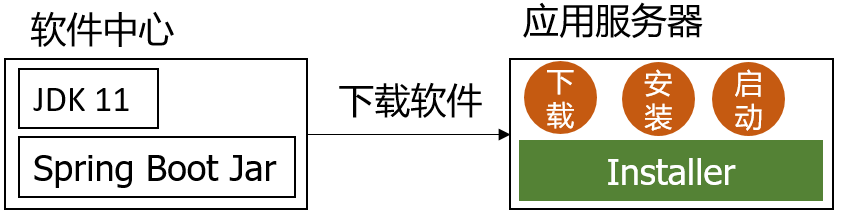

# BlockLang Installer

|             **Linux**               |            **Windows**             |
| :---------------------------------: | :--------------------------------: |
| [![Trivas-ci][tci badge]][tci link] | [![Appveyor][avy badge]][avy link] |

BlockLang Installer 是一款云部署工具。
安装在应用服务器上，用于自动化安装、升级 Spring Boot 项目：

1. 从 [Block Lang 软件中心](https://blocklang.store)下载 Spring Boot Jar 文件和依赖的 JDK 文件；
2. 在应用服务器上运行 Spring Boot Jar。

## 功能

1. 从软件中心下载 JDK 和 Jar 文件；
2. 在应用服务器上安装 JDK 和 Jar 文件；
3. 启动 Jar 文件。

欲了解功能更新日志，详见 [CHANGELOG.md](CHANGELOG.md)。

## 安装 BlockLang Installer

* [在 Windows 上安装](docs/install/windows.md)

## 升级 Spring Boot Jar

使用 `blocklang-installer update` 命令将 Spring Boot Jar 升级到最新版本。

注意：此命令只升级 Spring Boot Jar，没有升级 BlockLang Installer 软件。

## RESTful API

BlockLang Installer 与软件中心交互的 REST API。

BlockLang Installer 向软件中心请求数据：

1. [注册和更新项目信息](docs/API/01_installers.md)
2. [下载软件](docs/API/02_softwares.md)

## 社区

每晚7:00-9:00抖音和斗鱼同步直播

1. 斗鱼直播间： <https://www.douyu.com/6140385>
2. 抖音号：jinzhengwei
3. QQ群：619312757

<!-- prettier-ignore -->
[tci badge]: https://travis-ci.org/blocklang/blocklang-installer.svg?branch=master
[tci link]: https://travis-ci.org/blocklang/blocklang-installer
[avy badge]: https://ci.appveyor.com/api/projects/status/bm3mrtr4p0vu8kx8?svg=true
[avy link]: https://ci.appveyor.com/project/xiaohulu/blocklang-installer